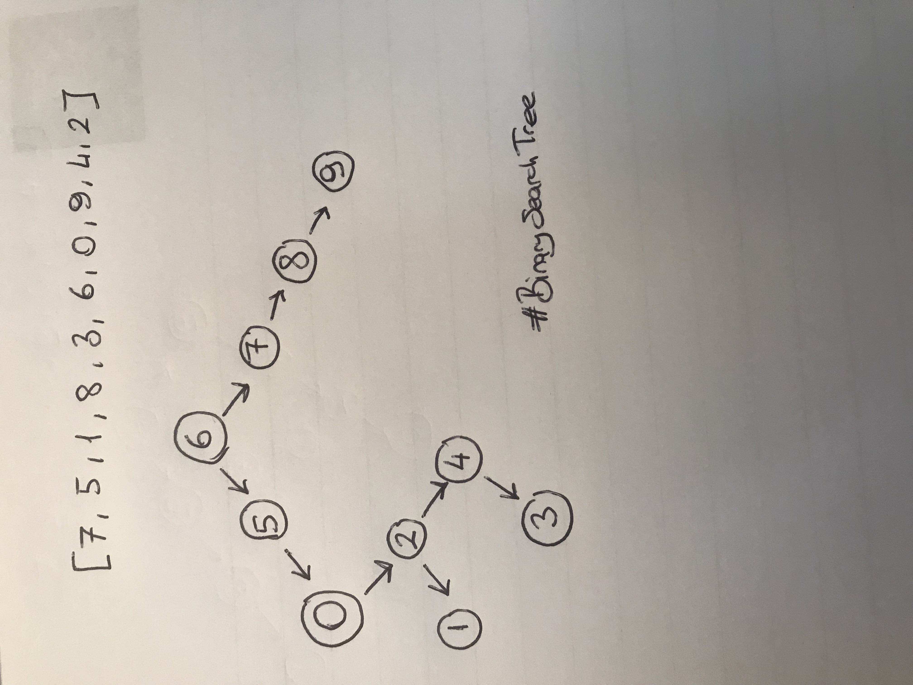

# Binary Search Tree Projesi

Bu repo [Kodluyoruz](https://www.kodluyoruz.org/) Veri Yapilari ve Algoritmalar Egitiminde olusturdugumuz ucuncu repo. Icersinde bir adet README dosyasi ve gorselin oldugu images klasoru barindiriyor.

## Proje 1



## Installation

---

Öncelikle projeyi clonelayın.

```
git clone https://github.com/anLpk/BinarySearchTree
```

## Usage

---

Projeyi cloneladıktan sonra Visual Studio Code programında açınız.
Linux için:

```
cd BinarySearchTree
code .
```

## Contributing

---

Pull requestler kabul edilir. Büyük değişiklikler için, lütfen önce neyi değiştirmek istediğinizi tartışmak için bir konu açınız.

## Licence

---

[MIT](https://choosealicense.com/licenses/mit/)
